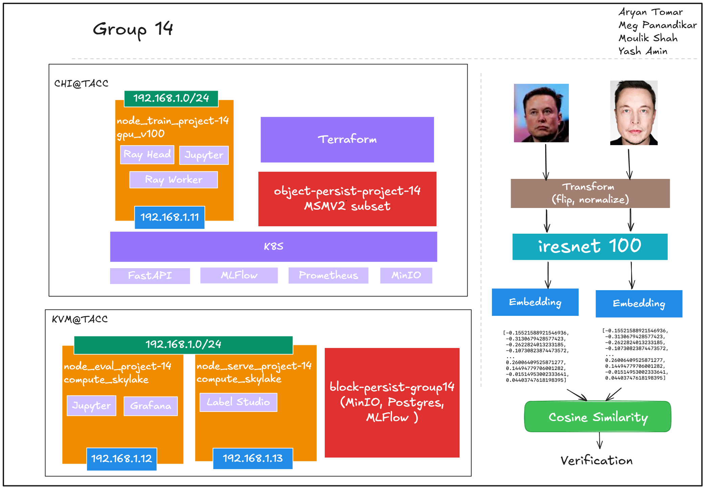

# MLOps Project


## Facial Recognition system for student authentication at NYU

# 
Value proposition: <br>
A facial recognition system will be used for authentication for exams/tests at NYU. This will act as a 2 factor authentication along with the user’s ID card, ensuring that there is no cheating during the exam.

Status Quo: Currently no attendance system or official system exists for verifying student identities. If any class did decide to take attendance manually, it would be hard to verify and take a lot of time

Business metrics:
- Security: Unauthorized students will not be able to enter the testing area.
- Efficiency: Manual attendance and student verification is time consuming and will take unnecessary manpower
- Scalability: This verification will scale well for Online exams, where faces can be checked at one time, if needed to explore in the future

## Contributors

| Name                            | Responsible for | Link to their commits in this repo |
|---------------------------------|-----------------|------------------------------------|
| All team members                |   System diagram, Planning                   |                                                                              |
| Megh Panandikar                 |   Model serving  and Monitoring              |  https://github.com/MoulikShah/MLOps_Project/commits/main/?author=megh2001   |
| Moulik Shah                     |   Data pipeline                              |  https://github.com/MoulikShah/MLOps_Project/commits/main/?author=MoulikShah |
| Aryan Tomar                     |   Model training                             |  https://github.com/MoulikShah/MLOps_Project/commits/main/?author=aryntmr    |
| Yash Amin                       |   Continuous X pipeline                      |  https://github.com/MoulikShah/MLOps_Project/commits/main/?author=Yash-5865  |


## System diagram




## Summary of outside materials

|              | How it was created | Conditions of use |
|--------------|--------------------|-------------------|
| MS1MV2       |  	Cleaned and refined MS-Celeb-1M dataset (~5.8M images, 85K IDs)                  |       Free for use           |
| VGGFace2     |    Collected via Google Images; 3.3M images, 9K+ identities                |         Research only          |
| iResNet-50   |    Deep residual network trained on large face datasets               |          Open-source         |
| MTCNN        |    Trained on various public datasets, by MIT                |         Open source         |

Common dataset link: https://github.com/deepinsight/insightface/tree/master/recognition/_datasets_

## Summary of infrastructure requirements

| Requirement     | How many/when                                     | Justification |
|-----------------|---------------------------------------------------|---------------|
| `m1-medium` | 2 for entire project                           | 1 in model serving and 1 for model evaluation and load testing           |
| `gpu_v100`     | 4 gpus/ 4 slots of 5 hours                        |       Required for training the ResNet-50 for the large database        |
| Floating IPs    | 2 running throghout the project                |    1 for model serving api, 1 for monitoring while training, testing and serving  |
| Persistent Volume  - 'block storage'   |                1 volume - 10GB                                  |       Needed to store model checkpoints, logs, retrained models, and OpenVINO outputs        |
| Object Storage 'CHI@TACC Swift' |   1 volume - 50GB     |  Storing the static dataset

## Implementation
---

# Unit 4 and 5: Model Training and Infrastructure

```text
Directory structure (for training part only)
Project Root
├── docker-compose-train.yaml       # Compose file to build & run the training container
├── Dockerfile                      # Dockerfile for setting up the training environment
├── training_scripts/               # Folder containing setup and utility scripts
│   ├── install_requirements.sh     # Installs Python packages for CUDA setup
│   ├── install_requirement_amd.sh  # Installs Python packages for AMD setup
│   ├── setup_docker.sh             # Initializes base environment setup
│   ├── setup_nvidia.sh             # Sets up NVIDIA drivers/libraries
│   ├── setup_amdgpu.sh            # Sets up AMD GPU environment
│   ├── setup_rclone.sh             # Configures rclone for object storage access
│   ├── mount_object_store.sh       # Mounts object store to a local path
│   ├── mount_block_volume.sh       # Mounts block volume as persistent disk
│   └── block_storage_mount.py      # Python script to automate block volume mount
└────── arcface_torch/                  # Main training code directory (ArcFace-based)
        ├── train_v2.py                 # Main distributed training script
        ├── run.sh                      # Script to launch training
        ├── requirement.txt             # Pip requirements for CUDA setup
        ├── requirement_amd.txt         # Pip requirements for AMD ROCm setup
        ├── promote_model.py            # Script to push final model to registry/storage
        └── (other training scripts and utility modules)

```
## UNIT 4: Model Training

### Training Flow Overview

- `run.sh` is the entrypoint script that:
  - Activates the Python virtual environment (`mlops_env`)
  - Launches the training script by running:  
    `python3 train_v2.py configs/ms1mv3_r50_onegpu.py`

- `train_v2.py` is the main training driver script that:
  - Loads training configuration from `ms1mv3_r50_onegpu.py`
  - Initializes the dataset using a custom PyTorch `get_dataloader`
    - Loads face images from class folders and applies preprocessing
  - Constructs the face recognition model using a iResNet-50 backbone

- The script executes a standard training loop

- During training:
  - Model and System metrics are recorded to monitor performance

- MLFlow is used to log experiments:
  - Tracks hyperparameters, training metrics, and test results
  - Enables comparison between training runs through the MLFlow UI

### Implemented the following as part of the Modeling

- Batch_size variation experiments, monitored the GPU_Utilization through system metric logging in MLFlow. Found optimal batch_size giving maximum gpu_utilization.
- Mixed Precision training using PyTorch's Automated Mixed Precision method, `torch.cuda.amp.grad_scaler.GradScaler`.
- Gradient accumulation by updating weights only after `gradient_acc` number of steps.
- Parallel programming (ddp) using `torch.nn.parallel.DistributedDataParallel`, successfully tested on AMD GPU. (But was not able to log GPU metrics specifically for those, some issue on AMD GPU).

## UNIT 5: Training Infrastructure and Pipeline

### 0. Setup MLFLOW server and MINIO storage on KVM@TACC

Bring up the container `docker-compose-block.yaml` to setup persistent storage on KVM@TACC (which was created as part of the continuous pipeline with permanent float-ip on node1).

### 1. Training Node Setup and start training (with bash scripts)

Several shell scripts were used to automate the setup of the training environment on a GPU-enabled cloud instance:

 Run
 `chmod +x {script-name}.sh`
 `./{script-name}.sh`
 to execute the scripts.

#### i. Install docker, rclone and complete object storage mounting

- **setup_docker.sh**  
  Installs Docker and adds the current user to the Docker group to enable container usage without `sudo`. Required for containerizing the training workflow.
  
- **setup_rclone.sh**  
  Installs `rclone`, configures it to connect to the Chameleon object storage backend, and enables the `allow_other` setting for user-level FUSE mounts. Verifies access to the `chi_tacc` storage remote.

- **mount_object_store.sh**  
  Mounts the dataset from Chameleon object storage to `/mnt/object` using `rclone mount` with Swift optimizations. This makes the dataset available for containers to bind-mount during training. This path was bind-mounted into all containers to provide direct access to the data without copying.

#### ii. Install NVIDIA toolkit and python environment for training

- **setup_nvidia.sh**  
  Installs the NVIDIA container toolkit and configures Docker to support GPU access within containers. Also installs `nvtop` for GPU monitoring.

- **install_requirements.sh**  
  Installs Python 3.8 and creates a virtual environment (`mlops_env`) for the training code. It installs all dependencies from `requirement.txt` and applies a patch to fix a known MXNet compatibility issue with NumPy.

#### iii. Start training
- **run.sh**
  Brings up the environment, runs the file `train_v2.py` with suitable config file which starts training.

#### iv. Model Saving and Registering
- **train_v2.py**
  Stores training logs and artifacts to the `MLFLOW_TRACKING_URI` internally.

- **promote_model.py**
  Registers a model for further stages.

### 2. Docker Container for Training (Training with container instead of bash script)

- **Defined in**: `docker-compose-train.yaml`
- **Built from**: Custom `Dockerfile` tailored for training

Just bring up this training container to start training. (Note that you still need to complete `Install docker, rclone and complete object storage mounting` step before bringing up this container).

 Run
 `docker compose -f docker-compose-train.yaml up --build`
 to bring up the container.

#### i. Dockerfile Overview

The `Dockerfile` used for building the `face-trainer` container consolidates and automates the setup tasks originally performed by the shell scripts (`setup_docker.sh`, `setup_nvidia.sh`, `install_requirements.sh`).

- **Base Image and System Packages**  
  The Dockerfile starts from a base `CUDA` image and installs essential system packages including Python 3.8, `build-essential`, `git`, `curl`, and others needed for compiling and running ML libraries.

- **Python Environment Setup**  
  Python 3.8 is set up using `deadsnakes/ppa`, and a virtual environment is created inside the container at `/app/mlops_env`. This replaces the functionality of `install_requirements.sh`.

- **Dependency Installation**  
  Python packages are installed from `requirement.txt`, which includes dependencies like PyTorch, MXNet, and MLFlow needed for training the ArcFace model. This mimics the pip install step in `install_requirements.sh`.

- **MXNet Patch**  
  The same patch applied manually in the `.sh` script to fix the `onp.bool_` alias issue in `mxnet/numpy/utils.py` is also performed in the Dockerfile automatically.

- **Working Directory and Entrypoint**  
  The working directory is set to `/app`, and the container is configured to activate the Python environment before running training code (if CMD or entrypoint is specified in Compose).

### ii. docker-compose-train.yaml overview
- Defines the `face-trainer` container.
- Builds from the Dockerfile with 96GB shared memory and GPU access.
- Mounts:
  - `/mnt/object → /app/datasets` (data)
  - `face_runs → /app/runs` (logs)
  - `face_weights → /app/weights` (model checkpoints)
  - `./training_scripts → /app/training_scripts` (code)
- Declares `face_runs` and `face_weights` as Docker named volumes (auto-created if missing).


### 3. Ray Cluster Deployment

Deployed on a single-gpu setup.

- The `docker-compose-ray-cuda-single-gpu.yaml` file spins up a minimal Ray cluster on a single node:
  - `ray-head`: Head node with ports exposed for dashboard (`8265`) and cluster communication (`6379`)
  - `ray-worker`: GPU-enabled worker container using the `rayproject/ray:2.42.1-gpu` image
- Both containers mount the dataset via `/mnt/object`.

### Extra files (for AMD GPU setup)

- `setup_amdgpu.sh`  (alternative to setup_nvidia.sh)
  Installs AMDGPU kernel drivers, ROCm toolkit, and SMI utilities for enabling AMD GPU support on Ubuntu.

- `install_requirement_amd.sh`  (alternative to install_requirements.sh)
  Sets up a virtual environment, installs ROCm-compatible PyTorch and dependencies from `requirement_amd.txt`, and patches MXNet for compatibility.

- `requirement_amd.txt`  (alternative to requirement.txt)
  Lists the Python dependencies required for training ArcFace on AMD GPUs, including MXNet, Torch, MLFlow, and system monitoring tools.

### Ignore files (not working)

- `docker-compose-ray-rocm` and `dockerfile.ray-rocm`

---

# Unit 6: Model serving:

### -Serving from an API endpoint:
We have wrapped our model in a fastapi backend application which runs on a seperate node_mode_serve_project-14 so that its performance is uninterrupted by trainnig and testing. It has a simple '/compare' endpoint which taks 2 image files as input, creates their embeddings using the model and then checks if they are the ame using a threshold for cosine similarity for the embeddings. 
You can find the application code and the docker-compose file to create a container and run the app and the other serving infrastructure at [model_serve](https://github.com/MoulikShah/MLOps_Project/tree/main/model_serve)
Model may be live at [this](http://129.114.25.133:8000/docs#/default/compare_faces_compare_post) site

### -Identify requirements:
Since we are running an offline service that will only handle concurrent users at entrances to exam halls, the throughput of the system is not very important. 
However we would like a short latency so that our system does not cause delays as each student is entering the classroom 1 by 1. These are the requirements
Throughput: > 1 req/sec
Latency: < 900ms

### -Model optimizations to satisfy requirements:
Since we want to explore and use different optimization techniques and execution providers, we have attempted to run the model, batched and with single sample with a pytorch and onnx runtime. 
Sine our omdel is very lightweight, model optimizations are not needed. Model testing was done [here](https://github.com/MoulikShah/MLOps_Project/tree/main/model_serve/model_opt.ipynb). 

### -System optimizations to satisfy requirements:
**Backend:** We will use a simple fastapi server as the backend as it is simple, light and matches our throughput/latency requirements  

---

## Unit 7: Evaluation and monitoring

### -Offline evaluation of model: 
We have the following tests for offline monitoring: 
1) Standard tests: This consists of tests with postiive pairs (2 images of same person) and negative pairs (1 anchor image of the person with a randomly selected image).
   Domain specific tests: pThese results are more significant as they show ius how the odel will behave with real world inputs. Here we used a pretrained model, deepface to obtain age gender and ethnicity for each identity. Positive pairs for people under the eage of 30 were taken.
   Negative paird were chosen for identites with the same ethnicity and gender, since it is morelikely for fraud cases.
2) Population slices: We have created subsets for the following population slices: Indians and middle eastern, Asian, White and Black. We ave also created subsets based on gender.
3) Test on known failure modes: Here we have handpciked samples from the domain specific set (same ethicity and gender) that look particularly similar, we have also picked some cases with bad lighting and blur, cases we believe the model may struggle.
4) Template based tests:

The results of this testing and evaluation will be automatically saved in MLFlow which will be accessed from a through a floating IP. If a certain threshold of each test type is passed, the model will be automatically saved to the model registry via MLFlow.
The offline tests are documented [here](https://github.com/MoulikShah/MLOps_Project/tree/main/eval_testing/tests) 

The entire pipeline from getting a model from ML Flow after training, copying it to node to run offline tests, saving results of offline tests to mlflow, if passed registering the model and movng to staging- 
simulated through bash script [here](https://github.com/MoulikShah/MLOps_Project/tree/main/eval_testing/offline_tests.sh)


### -Load test in staging: 
After our model passes all the offline tests,, it will be moved to the staging area, here we will pas in a large subset for load testing and display the results: 
  Throughput 
  Latency

### -Online evaluation in canary:
Here we will conduct an online evaluation, which is when we use data similar to real users, (ages < 35, ethnicity split: 1/3rd Indian, 1/3rd Asian, 1/3rd white and black). 
Our data will be sent to our base model as well as our newly trained model, and we will compare our results, new model will only be moved forward if it fairs better than the base model.

### -Close the loop:
Here we assume to get feedback in 2 ways. Positive feedback will be automatically sent back as a v small subset of correctly predicted cases.
For negative feedback there can be 1 of two cases - If the person does not get correctly recognized and the professor or staff has to manually verify, If a person manages to cheat the model and happens to get caught. we will specifically label data of similar looking people usnig label studio. rest of the negative feedback data wil be automated since we have ground truth labels.

### -Business specific metrics:
- Improvement in security and reduced fraud/cheating:  
If we happen to record the number of instances that a person has been caught cheating per year or semester, we can check these results pre and post our ML implementation. 
if there is a decrease, we know that thee has been an increase in academic integrity.

- Efficiency:  
In place of taking manual attendance we should see a much faster system with automated attendance. If we record two groups, one with manual attendance and one with the ML system, we should see a decrease in total time for conducting the examination.

---

## Unit 8: Data pipeline

### Persistent Storage Infrastructure

Our face recognition system utilizes *Chameleon Cloud's persistent storage* to manage large-scale datasets and artifacts, decoupling data from compute resources.

#### Object Storage (CHI@TACC Swift)

- *Size:* 6.7 GB of imm,utable training, evaluation and productiono data  
- *Container Name:* object-persist-project-14  
- *Access Method:* Mounted as *read-only* via rclone  
- *Contents:*
  - MS1MV2 dataset (~5.8M images, 85K identities)
  - Test verification sets categorized by:
    - Ethnicity
    - Quality factors

#### Block Storage (KVM@TACC)

- *Size:* 18GB allocated for mutable data  
- *Volume Name:* block-persist-group14  
- *Access Method:* Mounted as ext4 at /mnt/block  
- *Contents:*
  - Model checkpoints
  - Generated face embeddings
  - Evaluation metrics and logs
  - MLflow experiment tracking artifacts


### Offline Data: Training Data Organization

Face recognition datasets follow a strict organizational structure, enabling efficient training and evaluation across multiple benchmarks and applications.

### Data Pipeline Workflow

#### 1. 🧪 Extract

- *MS1MV2:* Subset of MS-Celeb-1M (cleaned)
- *VGGFace2:* Scraped from Google Images
- *NYU Test Data:* Synthetically generated with desired distributions

#### 2. 🧼 Transform

- Face detection using *MTCNN*  
- Image normalization: 112x112 px, RGB  
- Sample filtering based on:
  - Clarity
  - Alignment
  - Size  
- Data augmentation:
  - Brightness & contrast shifts
  - Rotations

#### 3. 🧵 Load

- Transformed data uploaded to *object storage*
- Training pipeline:
  - Loads batches with efficient caching
  - Stores generated *embeddings* on block storage


#### Data Quality and Validation

- Pre-processing checks for:
  - Minimum face clarity & alignment
  - Balanced demographics (ethnicity, gender, age)
  - Duplicate removal

#### Production Data Simulation

Simulated student check-in scenarios include:

- Dynamic lighting (e.g., classroom lighting)
- Occlusions: Glasses, masks, hair
- Motion blur (low to high)
- Random batch arrivals


#### Data Flow for Retraining

- *False negatives* captured via feedback API  
- Problem samples saved to block storage  
- Regular retraining incorporates flagged cases  
- New student data handled by separate onboarding pipeline

#### 🛠 Scripts and Tools

- mount_object_store.sh: Mounts object storage with caching optimizations  
- setup_rclone.sh: Sets up rclone credentials  
- Docker containers mount storage volumes for training pipeline access

### Online Data

- A simulated stream mimics real-time images captured at exam entry gates

---

## Unit 3: Continuous X

### Infrastructure-as-Code

- All infrastructure is provisioned using Terraform for resources, IPs and volumes on Chameleon Cloud.
- Ansible Playbooks are used to configure and deploy:
  - Triton Inference Server
  - MLflow
  - Prometheus
  - API services (FastAPI)

---

### Cloud-Native Architecture

- **Immutable Infrastructure**:
  - Infrastructure changes are made via pull requests to Git, then re-provisioned.
- **Microservices**:
  - The system is split into containers: API Server, Inference, Monitoring, Training, Testing, Storage
  - Each container communicates via APIs
- **Containerization**:
  - All services are Dockerized and deployed with Kubernetes.
  - Model training and inference environments are decoupled and reproducible.

---

### CI/CD and Continuous Training Pipeline

- ArgoCD power our CI/CD and retraining pipelines:
  - Triggered on schedule (ideally per semester to include new students).

---

### Staged Deployment

- Services will be promoted from one environment to another using AgroCD.
- **Staging**:
  - Load-tested with student entries.
- **Canary**:
  - Small percentage of live exam verifications pass through new model.
  - Metrics monitored via Prometheus.
- **Production**:
  - Model promoted if no degradation is observed during canary phase.


## Project Structure Overview

### `Terraform/`

This directory contains the infrastructure-as-code configuration using **Terraform** to provision resources on Chameleon Cloud.
Different subdirectories have the code for provisioning resources on different sites.

- `main.tf`: Defines the virtual machines (VMs), their images, flavors (e.g., `m1.medium`), networks, and ports.
- `variables.tf`: Declares input variables like `skylake_id` for lease binding.
- `data.tf`: Fetches existing OpenStack resources like networks and security groups.
- `outputs.tf`: Displays IPs and other relevant outputs after provisioning.
- `terraform.tfvars`: Stores actual values for input variables used during apply.

### `Ansible/`

This directory contains automation scripts for configuring the provisioned infrastructure using **Ansible**.

- `inventory.yml`: Defines the hosts (e.g., `node1`, `node2`) with their corresponding IP addresses and SSH users. Ansible uses this inventory to connect and manage each node.
- `playbook.yml`: The main playbook that includes tasks for setting up the software environment on the nodes—such as installing Docker, Kubernetes components, and other dependencies.

### `Setup Files/`

The `Setup Files/` directory contains utility and scripts that prepare each node for further configuration and deployment. It is also used to clone this repository to the local Jupyter interface and install dependencies for terraform, ansible and kubernetes.


